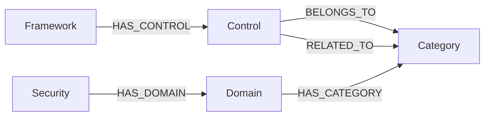

# Security Knowledge Graph Prototype (Neo4j)

CASP, ISMS-P, ISO/IEC 27001:2022의 이기종 보안 통제항목을 공통 보안 개념으로 통합하기 위한 Neo4j 기반 Security Knowledge Graph 프로토타입입니다.

> 이 저장소의 Mapping은 연구용 프로토타입에서 수행한 **수동 의미 판단** 결과이며, 각 기관이 공식적으로 제공하는 crosswalk가 아닙니다.

## 1. 최종 그래프 구조



- `Framework`: 보안 기준의 출처
- `Control`: 개별 보안 통제항목
- `Security`: 최상위 보안 개념
- `Domain`: 공통 보안 영역
- `Category`: 세부 공통 보안 개념
- `BELONGS_TO`: Primary Mapping
- `RELATED_TO`: Secondary Mapping

## 2. 구축 규모

| 구분 | 개수 |
|---|---:|
| Security | 1 |
| Framework | 3 |
| Domain | 16 |
| Category | 67 |
| Control | 248 |
| **전체 Node** | **335** |
| HAS_DOMAIN | 16 |
| HAS_CATEGORY | 67 |
| HAS_CONTROL | 248 |
| BELONGS_TO | 248 |
| RELATED_TO | 58 |
| **전체 Relationship** | **637** |

Framework별 Control 수:

- CASP: 54
- ISMS-P: 101
- ISO27001: 93

## 3. 실행 환경

프로토타입은 Neo4j Desktop 2의 `neo4j` 데이터베이스에서 Cypher 기반으로 구축했습니다.

Neo4j 버전에 따라 화면 UI는 달라질 수 있지만, 저장소의 Cypher는 Neo4j 5+/Cypher 25 문법을 기준으로 정리했습니다.

## 4. 가장 쉬운 구축 방법

새 데이터베이스에서 `cypher/00_build_all.cypher`를 위에서부터 실행합니다.

또는 아래 파일을 순서대로 실행해도 됩니다.

1. `cypher/01_constraints.cypher`
2. `cypher/02_taxonomy.cypher`
3. `cypher/03_frameworks.cypher`
4. `cypher/04_controls.cypher`
5. `cypher/05_framework_control.cypher`
6. `cypher/06_primary_mapping.cypher`
7. `cypher/07_secondary_mapping.cypher`
8. `cypher/08_validation.cypher`

`cypher/99_DANGER_reset_database.cypher`는 모든 데이터를 삭제하므로 초기화가 필요한 경우에만 사용합니다.

## 5. 검증

구축 후 `cypher/08_validation.cypher`의 Query를 순서대로 실행합니다.

정상적인 최종 결과:

```text
Nodes          = 335
Relationships  = 637
Controls       = 248
```

또한 Primary Mapping 무결성 검증 Query는 `No records`가 나오는 것이 정상입니다.

## 6. 데이터 파일

`data/`에는 Neo4j 구축 데이터를 CSV 형태로 함께 제공합니다.

- `frameworks.csv`
- `domains.csv`
- `categories.csv`
- `controls.csv`
- `primary_mapping.csv`
- `secondary_mapping.csv`

CSV는 데이터 검토, 재현성 확인, 향후 Python 기반 알고리즘 실험에 사용할 수 있습니다.

## 7. 시연 Query

`cypher/09_demo_queries.cypher`에는 발표에서 사용하기 좋은 핵심 Graph Query를 정리했습니다.

특히 다음 흐름을 확인할 수 있습니다.

```text
Framework → Control → Category ← Domain ← Security
```

그리고 `CASP-033` 예시를 통해 다음 관계를 확인할 수 있습니다.

```text
CASP-033 ── BELONGS_TO ──> IAM-03
CASP-033 ── RELATED_TO ──> IAM-04
```

## 8. SBERT Category 추천 프로토타입

새로운 보안 Control 문장을 입력하면 Neo4j의 67개 Category와 의미 유사도를 비교해 가장 유사한 Category Top-3를 추천하는 프로토타입을 구현했습니다.

기본 흐름:

```text
Control 문장
    ↓
SBERT
    ↓
문장 Vector
    ↓
67개 Category와 Cosine Similarity 계산
    ↓
가장 유사한 Category 추천
```

다국어 Sentence Transformers 모델과 Cosine Similarity를 사용하며, Neo4j 데이터는 조회만 하고 변경하지 않습니다.

- 빠른 실행 안내: [`algorithm/README.md`](algorithm/README.md)
- 상세 실행 및 동작 방식: [`docs/sbert_prototype.md`](docs/sbert_prototype.md)

## 9. 주의

이 저장소에는 연구 목적으로 정리한 보안 통제항목 정보가 포함되어 있습니다. 특히 ISO/IEC 표준 관련 텍스트는 저작권 및 이용 조건이 적용될 수 있으므로, **공개 GitHub 저장소로 배포하기 전에 사용 권한과 공개 가능 범위를 반드시 확인**해야 합니다. 권리가 불분명하면 Private Repository 사용을 권장합니다.

자세한 내용은 `NOTICE.md`를 확인하세요.
