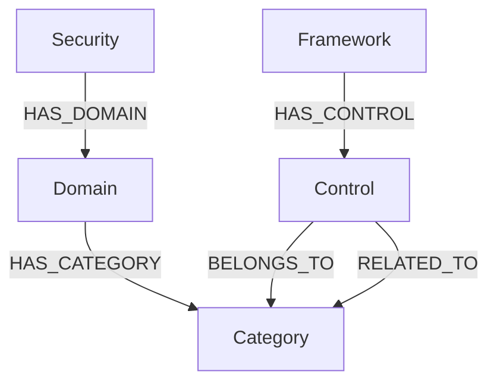

# Graph Schema

## Node Labels

### `Security`
최상위 보안 개념입니다.

주요 속성:
- `id`
- `name`

### `Framework`
보안 통제항목의 출처를 나타냅니다.

예:
- `CASP`
- `ISMS-P`
- `ISO27001`

### `Domain`
이기종 보안 기준을 통합하기 위해 정의한 공통 상위 보안 영역입니다.

총 16개입니다.

### `Category`
공통 세부 보안 개념입니다.

총 67개이며, 서로 다른 Framework의 Control을 연결하는 허브 역할을 합니다.

### `Control`
각 보안 기준의 개별 통제항목입니다.

주요 속성:
- `id`
- `framework`
- `control_id`
- `title`
- `original_level1`
- `original_level2`
- `original_detail`
- `mapping_status`
- `note`

## Relationship Types

```text
(:Security)-[:HAS_DOMAIN]->(:Domain)
(:Domain)-[:HAS_CATEGORY]->(:Category)
(:Framework)-[:HAS_CONTROL]->(:Control)
(:Control)-[:BELONGS_TO]->(:Category)
(:Control)-[:RELATED_TO]->(:Category)
```

### `BELONGS_TO`
Control의 Primary Mapping입니다. 모든 Control은 정확히 하나의 Primary Category를 가집니다.

### `RELATED_TO`
Control이 추가적으로 관련된 Category를 표현하는 Secondary Mapping입니다.

## 전체 구조


